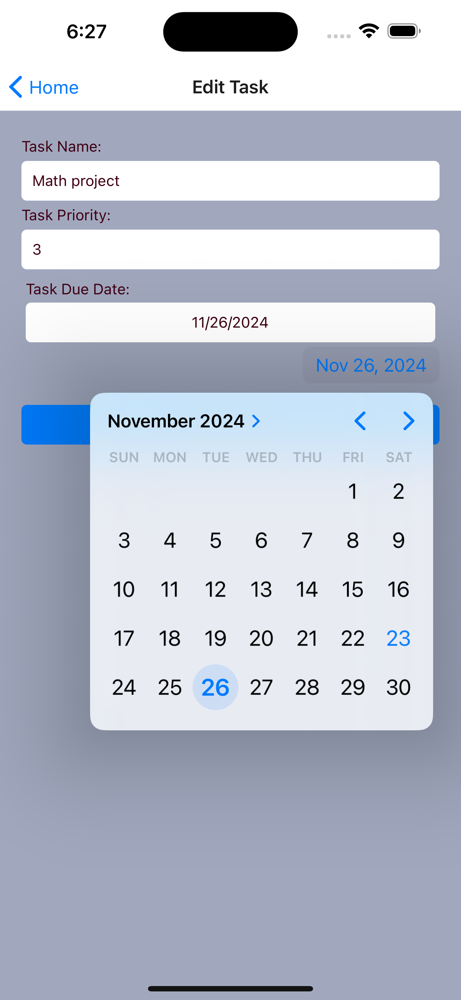
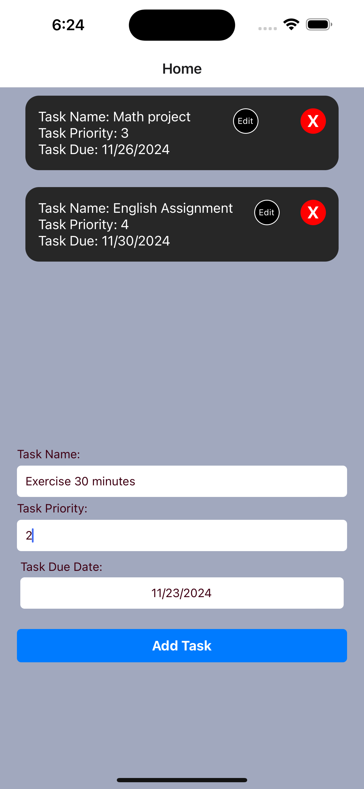

# Leon To-do List Application

A full-stack **To-Do List Application** that allows users to create, edit, delete, and view tasks with due dates and priority levels. The backend is powered by **Node.js** and **Knex.js** with a **MySQL** database, while the frontend is built using **React Native** with **Expo**.

---

## Features

- CRUD application include:
  - C (Create): Create tasks with a due date and priority levels.
  - R (Read): View the to-do list.
  - U (Update): Edit tasks, including the task name, due date, and priority.
  - D (Delete): Delete tasks once they are completed.

### Backend

- RESTful API built with **Express.js**.
- Database operations using **Knex.js**.
- **MySQL** integration for data storage.
- Environment configuration via **dotenv**.
- Scripts for migrations and seeds.

### Frontend

- Cross-platform mobile app built with **React Native** and **Expo**.
- Allows task creation, editing, and deletion.
- Task list displays due dates and priorities.
- Intuitive forms with custom date pickers and text inputs.
- Mobile-first design.

---

## Getting Started

### Prerequisites

- **Node.js** (v16+)
- **npm** or **yarn**
- **Expo CLI**
- **MySQL** database
- Code editor - **VS code**

---

### Installation

#### Backend Setup

1. Clone the repository:
   ```bash
   git clone <repository_url>
   cd backend
   ```
2. Install dependencies:
   ```bash
   npm install
   ```
3. Configure the environment variables:
   Create a `.env` file in the `backend` directory with the following content:

   ```env
   DB_HOST=<your_database_host>
   DB_USER=<your_database_user>
   DB_PASSWORD=<your_database_password>
   DB_NAME=<your_database_name>

   /* .env.sample
   PORT=8080
   DB_HOST=127.0.0.1
   DB_NAME=TodoList
   DB_USER=root
   DB_PASSWORD=rootroot
   */


   ```

4. Run database migrations:
   ```bash
   npm run migrate
   ```
5. Start the backend server:

   ```bash
   npm start
   ```

   The backend will run on `http://localhost:8080`.

#### Frontend Setup

1. Navigate to the `frontend` folder:
   ```bash
   cd frontend
   ```
2. Install dependencies:
   ```bash
   npm install
   ```
3. Start the app:
   ```bash
   npx expo start
   ```
4. Use the Expo QR code to open the app on a mobile device or run it on an emulator.

---

## Scripts

### Backend

| Script             | Description                             |
| ------------------ | --------------------------------------- |
| `npm start`        | Starts the backend server with Nodemon. |
| `npm run migrate`  | Runs database migrations.               |
| `npm run rollback` | Rolls back migrations.                  |
| `npm run seed`     | Seeds the database with sample data.    |

### Frontend

| Script            | Description                                    |
| ----------------- | ---------------------------------------------- |
| `npm start`       | Starts the Expo development server.            |
| `npm run android` | Runs the app on an Android emulator or device. |
| `npm run ios`     | Runs the app on an iOS emulator or device.     |
| `npm run web`     | Runs the app in a web browser.                 |

---

## API Endpoints

### Backend

- **GET /** - Fetch all tasks.
- **POST /** - Add a new task.
- **PUT /:id** - Update a specific task by `id`.
- **DELETE /:id** - Delete a specific task by `id`.

---

## Technologies Used

### Backend

- **Node.js**
- **Express.js**
- **Knex.js**
- **MySQL**
- **dotenv**

### Frontend

- **React Native**
- **Expo**
- **Axios**
- **React Navigation**
- **React Native DateTimePicker**

---

## File Structure

### Backend

```
backend/
├── index.js             # Entry point for the backend server
├── migrations/          # Database migration files
├── seeds/               # Database seed files
├── package.json         # Dependencies and scripts for the backend
└── .env                 # Environment variables
```

### Frontend

```
frontend/
├── App.js               # Main entry point for the app
├── components/          # Shared UI components
├── pages/               # Screens (HomePage, EditTaskPage)
├── package.json         # Dependencies and scripts for the frontend
```

---

## Usage

1. **Add a Task**:

   - Fill in task name, priority, and due date.
   - Click "Add Task" to save it.

2. **Edit a Task**:

   - Tap "Edit" on an existing task.
   - Modify the details and save.

3. **Delete a Task**:

   - Tap "X" to remove a task.

4. **View Tasks**:

   - All tasks are listed on the home screen.

---

## Screenshots



### Home Page

- Displays a list of tasks with task name, priority, and due date.
- Buttons for editing or deleting tasks.

### Edit Task Page

- Form to modify task details such as name, priority, and due date.

---

## Demo


---

## Author

Developed by **Leon**. Make with [❤️ ](https://emojipedia.org/red-heart) in Canada.
